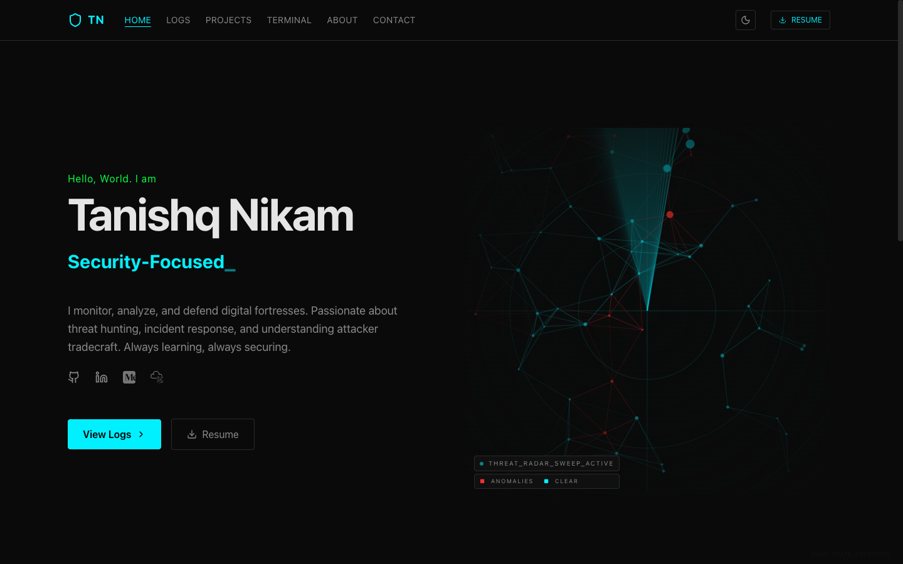

# 🛡️ TN-CYB: Cybersecurity Portfolio & SOC Dashboard

**Live Deployment:** [tanishqnikam.vercel.app](https://tanishqnikam.vercel.app)



Welcome to the **TN-CYB Portfolio**, a highly interactive, terminal-inspired web application designed to showcase my skills in security, automation, and engineering.

This repository diverges from standard developer portfolios by framing the user experience as a Security Operations Center (SOC) dashboard. It combines modern web performance with immersive "hacker-movie" aesthetics and practical demonstrations of security knowledge.

---

## 🚀 Key Architectural Features

- **Boot Sequence Overlay:** A one-time animated kernel-boot loader (`BootLoader.jsx`) that plays on first load before the site "grants access."
- **Interactive Terminal Environment:** A custom-built `/terminal` route that parses and resolves CLI commands natively in the browser (`help`, `whoami`, `ls`, `cat`, `hack`, etc.).
- **Markdown-Backed Documentation:** Uses localized markdown parsing (`lib/content.js`, `gray-matter`, `marked`) to render deep-dive Investigation Logs (`/logs`) and Security Projects (`/projects`) from local `.md` files, allowing for rapid update workflows.
- **Immersive Tech Aesthetic:** Pure CSS glassmorphism, CRT scanline overlays, global dark-mode constraints, and neon-accents built directly on top of modern Tailwind architecture.
- **Canvas-Based Threat Radar:** A custom `<canvas>` particle/radar animation (`ThreatRadar.jsx`) on the homepage simulating live incoming connections.
- **Fully Responsive & Optimized:** Built with Next.js (App Router) and React 19, ensuring fast static generation, Vercel Analytics telemetry, and buttery-smooth Framer Motion transitions.

---

## 🗺️ Site Structure

| Route | Description |
|---|---|
| `/` | Home — hero, typing header, threat radar, tools marquee |
| `/about` | About — background, timeline (Work/Extracurricular tabs) |
| `/projects` | Security projects, markdown-backed |
| `/logs` | Investigation logs / blog, markdown-backed |
| `/logs/[slug]` | Individual log/report detail page |
| `/contact` | Contact form |
| `/terminal` | Interactive in-browser CLI |

---

## 💻 Tech Stack

- **Framework:** [Next.js 16](https://nextjs.org/) (React 19, App Router)
- **Styling:** [Tailwind CSS v4](https://tailwindcss.com/)
- **Animations:** [Framer Motion](https://www.framer.com/motion/) & CSS keyframes
- **Icons:** [Lucide React](https://lucide.dev/)
- **Content:** [gray-matter](https://github.com/jonschlinkert/gray-matter) + [marked](https://marked.js.org/) for markdown-driven projects/logs
- **Extras:** [canvas-confetti](https://www.kirilv.com/canvas-confetti/) for celebratory easter eggs
- **Deployment & Analytics:** [Vercel](https://vercel.com/) + [@vercel/analytics](https://vercel.com/docs/analytics)

---

## 🛠️ Local Development

To run the TN-CYB interface locally on your machine:

1. **Clone the repository**
   ```bash
   git clone https://github.com/TanishqNikam/My-Web-Portfolio.git
   cd My-Web-Portfolio
   ```

2. **Install dependencies**
   ```bash
   npm install
   ```

3. **Start the development server**
   ```bash
   npm run dev
   ```

4. **Access the portal**
   Open [http://localhost:3000](http://localhost:3000) in your browser.

### Available Scripts

| Script | Description |
|---|---|
| `npm run dev` | Starts the local development server |
| `npm run build` | Builds the app for production |
| `npm run start` | Serves the production build locally |
| `npm run lint` | Runs ESLint against the codebase |

---

## 🏴‍☠️ The Easter Eggs (Hidden Payloads)

This portfolio is heavily gamified. I’ve layered **12 highly interactive Easter eggs** throughout the source code to reward curious technical recruiters and engineering managers who take the time to explore. 

Here is the complete manual of hidden features and how to trigger them:

### Global Triggers
1. **The Matrix Mode:** Type the classic Konami Code (`↑ ↑ ↓ ↓ ← → ← → B A`) anywhere on the site. The DOM will violently glitch and drop into a full-screen, green falling-character Matrix simulation.
2. **Self-Destruct Sequence:** Type `rm -rf /` anywhere on the site (or in the terminal). A chaotic animation will systematically delete DOM elements one by one before crashing into a "Kernel Panic" screen.
3. **C2 Backdoor Dashboard:** Press `Alt + C` (or `Option + C` on Mac). The website will flip 3D to reveal a hidden Command & Control radar dashboard with live streaming mock logs.
4. **Zero-Day Exploit:** Type `zeroday`. Your mouse cursor turns into a red crosshair. Clicking any element on the website physically "shatters" it and removes it from the DOM.

### Navbar & Header
5. **Brute Force Resume:** Hold `Shift` while clicking the `Resume` download button. This triggers a modal simulating a terminal running `Hydra` against a password hash before successfully "cracking" the encryption and downloading the PDF.
6. **The 3-Tap Glitch:** Rapidly double-click or triple-tap the Shield Logo (`TN`) in the top left. The website will experience a violent 1-second CSS tear and RGB color-split.
7. **Security Policy Violation (Light Mode):** Click the `Moon` icon next to the Resume button. The switch sparks, physically breaks off the UI, and throws a strict red toast notification stating: *"TN-CYB strictly enforces Dark Mode. Light mode is a security risk."* The button locks out for 5 seconds.

### The Terminal (`/terminal`)
8. **Sudo Hire Engagement:** Type `sudo hire` in the terminal. It authenticates a "priority engagement protocol", drops a burst of confetti over the screen, and automatically downloads the resume.
9. **Port Scanner CTF:** Type `hack` in the terminal. You enter a targeted mini-game where you have 5 attempts to guess a random 3-digit open port to breach the firewall, receiving "higher/lower" hints along the way. Winning prints an ASCII trophy.

### Discoverable UI Traps
10. **The Honeypot Button:** Located on the homepage, there is a very faint `[DEACTIVATE_DEFENSES]` button. Clicking it triggers a massive blaring red Security Alert modal locking down the page.
11. **The Phishing Trap:** On the `/contact` page, there is a hidden, nearly invisible link that says `[CLICK_HERE_FOR_FREE_ADMIN_ACCESS]`. Clicking it spawns a simulated Phishing Awareness training modal warning the user not to click suspicious links.
12. **The Ransomware Archive:** Scroll to the very bottom of the `/projects` page. Click the tiny `[ COMPRESS_CONFIDENTIAL_ARCHIVE.exe ]` text. A full-screen lockout occurs with a spinning skull, fake encryption progress bar, and a tongue-in-cheek ransom demand.

---

## 👤 Author

**Tanishq Nikam**

- Portfolio: [tanishqnikam.vercel.app](https://tanishqnikam.vercel.app)
- LinkedIn: [linkedin.com/in/tanishqnikam](https://linkedin.com/in/tanishqnikam)
- GitHub: [@TanishqNikam](https://github.com/TanishqNikam)
- Email: [tanishqnikam11@gmail.com](mailto:tanishqnikam11@gmail.com)
